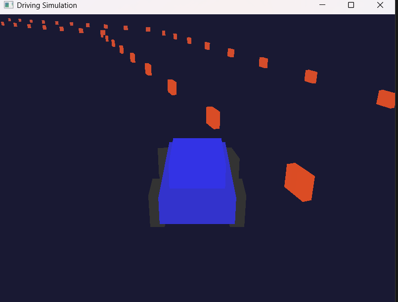

# 🚀几个项目
## 🖥️exe里下载可以直接执行
### 🎮RPGgame
 •基于C++与蓝图，构建了支持伤害、buff、暴击、格挡等丰富表现的RPG能力
系统，支持主角与敌人多样技能实现 
 •基于资源管理器，自动化全局标签注册，标签系统涵盖属性、抗性、技能、输入、
冷却等，便于扩展和复杂战斗逻辑实现 
 •实现了AI控制器、行为树等AI蓝图，支持敌人智能行为、技能释放与战斗决策，
提升游戏智能化体验                                              
 •开发了丰富的UI蓝图（如HUD、主菜单、属性面板等），实现角色属性、技能、
进度条、提示等多样化交互体验                                        
 •核心系统用C++实现，功能接口全面支持蓝图调用，提升策划与美术协作效率，
实现高扩展性和高可维护性的项目架构 

#### 
### ✨3d驾驶模拟

### ✨光照模型

